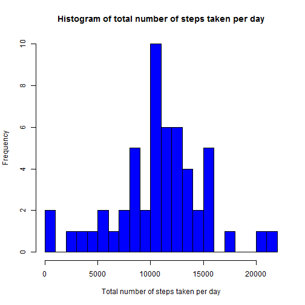
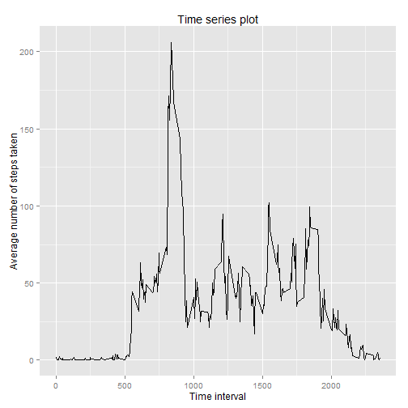
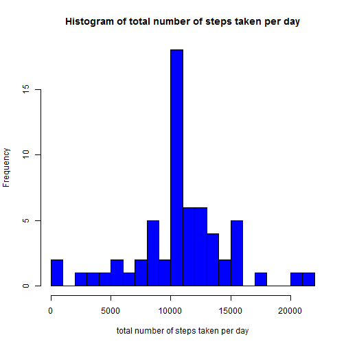
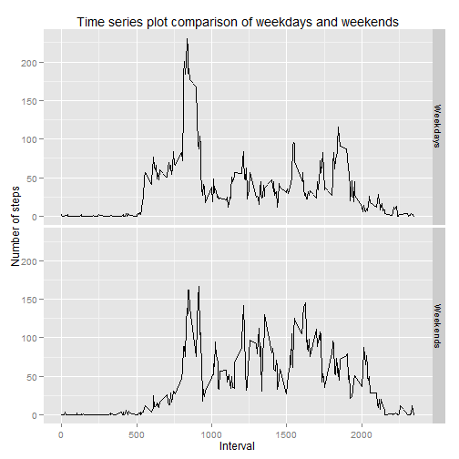

---
output:
  html_document:
    keep_md: yes
    self_contained: no
---
#Coursera Reproducible Research 
##Peer Assesment 1

*Let's get started*

First we are reading the data from the working directory.This dataset makes use of data from a personal activity monitoring device. This device collects data at 5 minute intervals through out the day. The data consists of two months of data from an anonymous individual collected during the months of October and November, 2012 and include the number of steps taken in 5 minute intervals each day.

Reading the data in R studio and intial formatting of the dataset, like converting date from factor to date format


```r
act<-read.csv("activity.csv")
act$date<-as.Date(act$date)
```

Let's load the packages that we are going to use for this particular exercise.

```r
library(ggplot2)
```


Now that we have our data loaded in R studio environment,let's remoev all the NA values to ease further analysis.  

```r
act_rmna<-act
act_rmna<-na.omit(act_rmna)
```
Let's look at the histogram of the total number of steps taken each day,

```r
s<-split(act_rmna$steps,act_rmna$date)
tot_steps_day<-sapply(s,sum)
hist(tot_steps_day,breaks=18,col="blue",xlab="Total number of steps taken per day",main="Histogram of total number of steps taken per day")  
```

 

calculating mean and median of the total number of steps each day.

```r
mean_tsd<-as.character(trunc(mean(tot_steps_day),2))
median_tsd<-median(tot_steps_day)
```
So, mean of total number of steps each day=10766  
and median of total number of steps each day=10765

Let's look at the time series plot of the step counts averaged across each day.


```r
act_agg<-aggregate(steps~interval,act,mean)
g<-ggplot(act_agg,aes(x=interval,y=steps))
g+geom_line()+xlab("Time interval")+ylab("Average number of steps taken")+ggtitle("Time series plot")
```

 

Now, let's look at the 5 minute time interval with maximum amount of steps,

```r
max_steps<-act_agg[act_agg$steps==max(act_agg$steps),]
max_st_int<-max_steps$interval
```

5-minute interval (average across all the days in the dataset) containing the maximum number of steps is 835.

Note that there are a number of days/intervals where there are missing values (coded as NA). The presence of missing days may introduce bias into some calculations or summaries of the data. 

Let's calculate number 'NA' in the dataset and fill all the NA values with the mean for that 5-minute interval.

```r
tot_na<-sum(is.na(act$steps))
act_2<-act
for(i in 1:(length(act_2$steps))){
  if(is.na(act_2$steps[i])){
    act_2$steps[i]=act_agg$steps[act_agg[,"interval"]==act_2$interval[i]]
  }
}
```

Total number of missing values in the dataset=2304

Let's look at the histogram of the total number of steps taken each day after substituting NA values,


```r
s2<-split(act_2$steps,act_2$date)
tot_steps_day_2<-sapply(s2,sum)
hist(tot_steps_day_2,breaks=18,col="blue",xlab="total number of steps taken per day",main="Histogram of total number of steps taken per day")
```

 

Now, let's see what is the change in the value of mean and median.

```r
mean_tsd_2<-as.character(trunc(mean(tot_steps_day_2),2))
median_tsd_2<-as.character(trunc(median(tot_steps_day_2),2))
```

So, mean of total number of steps each day=10766  
and median of total number of steps each day=10766

So, the mean remains same as that was in the previous case and the median only increases by 1.

Now,let's look at whether there is any change in activity during weekends. First divide the whole dataset in two sets of weekdays and weekends.

```r
act_3<-act_2
act_3$f<-ifelse(weekdays(act_3$date) %in% c("Saturday","Sunday"),"Weekend","Weekday")
wend<-subset(act_3,f=="Weekend")
wdays<-subset(act_3,f=="Weekday")
```


Now, let's compare the time series plot of  step counts averaged across each day for both cases of Weekend and Weekdays.

```r
act_agg_wdays<-aggregate(steps~interval,wdays,mean)
act_agg_wend<-aggregate(steps~interval,wend,mean)
act_agg_wdays$f<-"Weekdays"
act_agg_wend$f<-"Weekends"
act_agg_wdays$f<-as.factor(act_agg_wdays$f)
act_agg_wend$f<-as.factor(act_agg_wend$f)

act_agg_comb<-rbind(act_agg_wdays,act_agg_wend)

g<-ggplot(act_agg_comb,aes(interval,steps))
g+geom_line()+facet_grid(f~.)+xlab("Interval")+ylab("Number of steps")+ggtitle("Time series plot comparison of weekdays and weekends")
```

 

